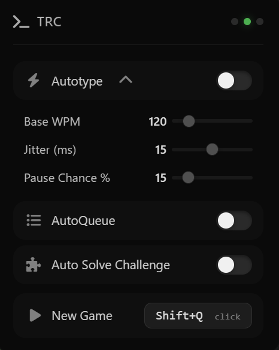

# Source

This simply includes the source of the script, and serves as the github page for it. You can actually do this:

```js
eval(await fetch("https://raw.githubusercontent.com/idkazul/TRC/refs/heads/main/source.js").then(r => r.text()))
```

And it'll run fine. Though, it is better if you [install it](https://greasyfork.org/en/scripts/592119-trc-the-newest-and-improved-typeracer-cheat) with a userscript manager!


– azul

# UI

A quick look at the UI:


